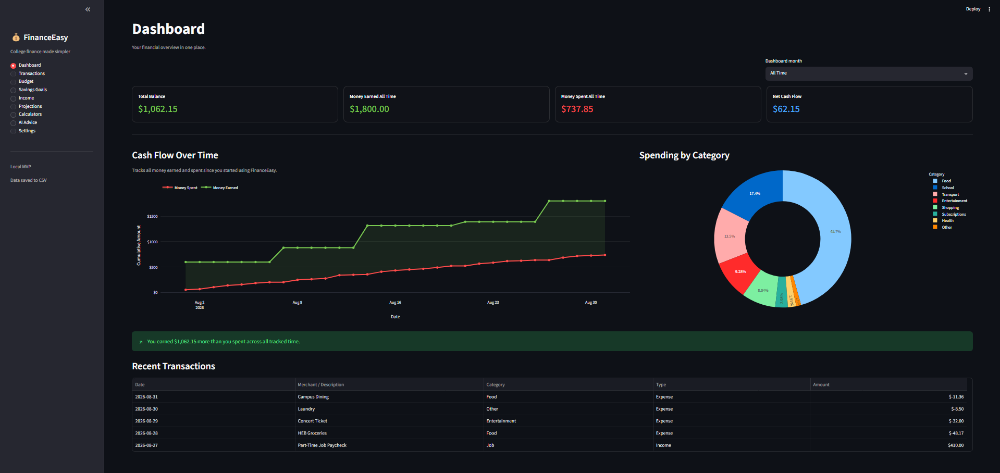
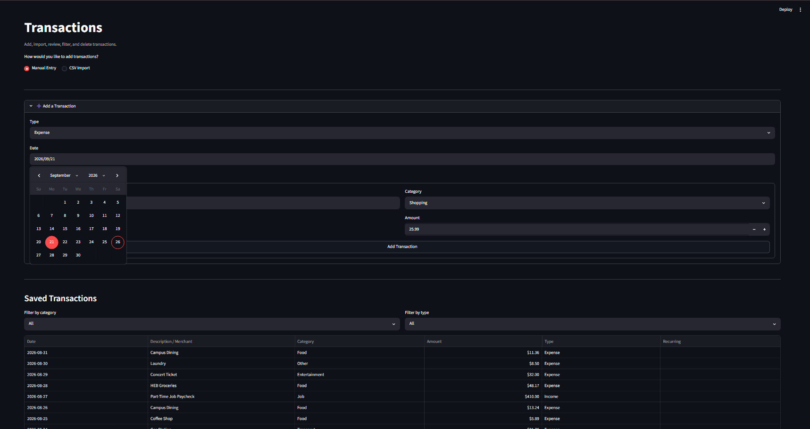
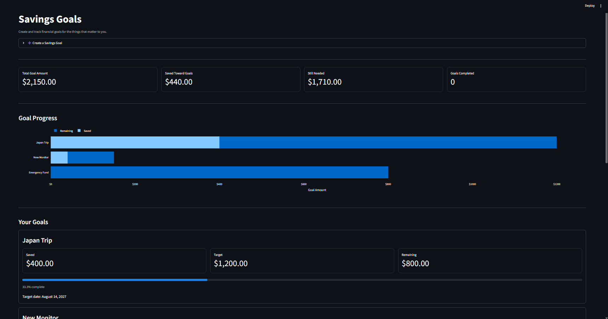
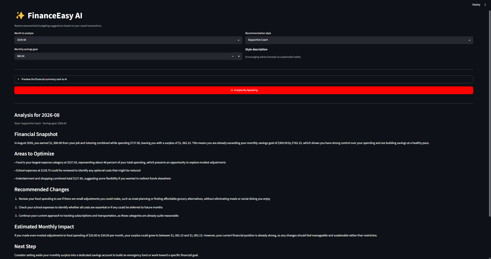
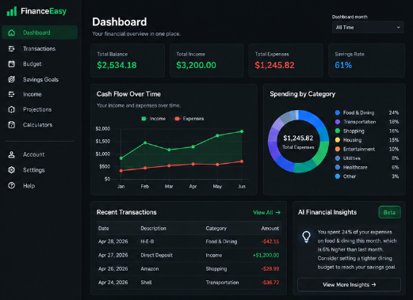
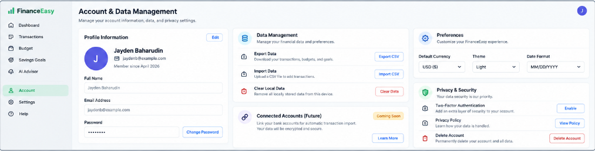

# 💰 FinanceEasy

**An AI-powered personal finance tracker built with Python, Streamlit, pandas, Plotly, and the Anthropic API.**

FinanceEasy is an interactive personal finance application designed to help users track income and expenses, monitor budgets, visualize spending patterns, manage savings goals, and receive personalized AI-generated financial insights.

The project combines **data processing, interactive visualization, persistent storage, and LLM integration** into a single financial dashboard.

> 🚧 **Development Status:** FinanceEasy is currently under active development. A publicly hosted version is planned and will be available soon. Additional features currently in development include user account functionality, authentication, completion of remaining application pages, and further improvements to the application's analytics and user experience.

## 📸 Preview



*FinanceEasy dashboard displaying account metrics, cash-flow trends, spending distribution, and recent transactions.*

---

## ✨ Features

### 📊 Financial Dashboard

* Track total balance, monthly income, spending, and remaining budget
* Filter financial data by month
* View interactive visualizations of spending and financial activity
* Analyze transaction data using pandas and Plotly

### 💳 Transaction Management

* Add and delete income and expense transactions
* Organize expenses into categories such as Food, Transport, Entertainment, Shopping, School, Housing, and more
* Validate and clean transaction data before processing
* Persist transaction history locally using CSV storage

### 🔁 Recurring Transactions

* Create recurring income or expenses
* Supports:

  * Weekly
  * Biweekly
  * Monthly
  * Yearly
* Automatically generates recurring transaction dates within a selected period

### 🎯 Budget & Savings Tracking

* Set and update a monthly spending budget
* Compare monthly spending against the configured budget
* Create and manage savings goals
* Track current progress, target amounts, target dates, and notes

### 🤖 AI-Powered Financial Insights

FinanceEasy integrates the **Anthropic API** to generate personalized budgeting recommendations based on the user's financial data.

Before data is sent to the model, FinanceEasy calculates and structures verified financial metrics including:

* Monthly income
* Monthly expenses
* Current surplus or deficit
* Spending by category
* Income by source
* Savings-goal progress

The AI is instructed to base its response only on these calculated values rather than inventing or recalculating financial information.

Users can also choose different recommendation styles, including:

* **Supportive Coach** — focuses on sustainable financial habits
* **Direct Analyst** — emphasizes concise, numbers-driven recommendations
* **Goal-Based Planner** — works backward from the user's savings goal

> **Note:** AI-generated recommendations are intended for educational budgeting purposes and are not professional financial, investment, tax, or legal advice.

---

## 🛠️ Tech Stack

| Technology        | Purpose                                                        |
| ----------------- | -------------------------------------------------------------- |
| **Python**        | Core application logic                                         |
| **Streamlit**     | Interactive web application and UI                             |
| **pandas**        | Transaction processing, validation, filtering, and aggregation |
| **Plotly**        | Interactive financial data visualizations                      |
| **Anthropic API** | AI-generated financial insights                                |
| **NumPy**         | Numerical/data-processing support                              |
| **python-dotenv** | Environment variable and API-key management                    |
| **CSV**           | Lightweight persistent storage                                 |
| **Git / GitHub**  | Version control and project management                         |

---

## ⚙️ How It Works

FinanceEasy follows a simple data-processing workflow:

```text
User Input / CSV Data
        ↓
Data Validation & Cleaning
        ↓
Persistent CSV Storage
        ↓
pandas Processing & Aggregation
        ↓
Financial Metrics
        ↓
Plotly Visualizations
        ↓
Structured Financial Summary
        ↓
Anthropic API
        ↓
Personalized Financial Insights
```

This architecture separates deterministic financial calculations from AI-generated recommendations. Financial totals are calculated by the application before being provided to the language model.

---

## 🚀 Getting Started

### Prerequisites

Make sure you have:

* Python installed
* Git installed
* An Anthropic API key if you want to use the AI recommendation features

### 1. Clone the repository

```bash
git clone https://github.com/JB5735/FinanceEasyV1.git
cd FinanceEasyV1
```

### 2. Create a virtual environment

**Windows**

```bash
python -m venv .venv
.venv\Scripts\activate
```

**macOS / Linux**

```bash
python3 -m venv .venv
source .venv/bin/activate
```

### 3. Install dependencies

```bash
pip install -r requirements.txt
```

### 4. Configure the Anthropic API

Create a `.env` file in the root directory:

```env
ANTHROPIC_API_KEY=your_api_key_here
```

Do **not** commit your `.env` file or API key to GitHub.

### 5. Run FinanceEasy

```bash
streamlit run app.py
```

Streamlit should automatically open the application in your browser.

---

## 📁 Project Structure

```text
FinanceEasyV1/
│
├── app.py
├── ai_test.py
├── requirements.txt
├── README.md
├── .gitignore
│
└── data/
    ├── expenses.csv
    ├── budget.csv
    └── savings_goals.csv
```

### `app.py`

Main FinanceEasy application containing the Streamlit interface, transaction-processing logic, financial calculations, visualizations, savings-goal functionality, and AI integration.

### `data/`

Stores persistent transaction, budget, and savings-goal information.

### `ai_test.py`

Used for testing AI/API functionality during development.

---

## 🧠 Data Processing

FinanceEasy uses pandas to process structured financial records through several stages:

```text
Load → Validate → Clean → Filter → Aggregate → Analyze → Visualize
```

Imported transaction data is standardized and validated before being added to the application's persistent dataset.

Transactions include information such as:

```text
date
description
category
amount
type
is_recurring
recurrence_frequency
recurrence_end_date
recurrence_id
```

The application then performs operations including category aggregation, monthly filtering, income/expense separation, sorting, and financial-summary calculations.

---

## 🔐 AI & Data Reliability

A major design goal of FinanceEasy is keeping **financial calculation separate from generative AI reasoning**.

Instead of asking the LLM to calculate financial totals from raw transactions, FinanceEasy first computes the relevant metrics using pandas.

The application then sends a structured summary to the model and explicitly instructs it to:

* Use only the supplied financial information
* Avoid inventing transactions or personal details
* Preserve application-calculated totals
* Provide educational budgeting guidance rather than professional financial advice

This approach makes the AI component primarily responsible for **interpreting verified data and generating understandable recommendations**, while deterministic application logic remains responsible for financial calculations.

---

## 🖥️ Application Preview

### Dashboard


View key financial metrics, cumulative cash flow, spending by category, and recent transactions from a centralized dashboard.

### Transaction Management



Add, categorize, filter, and manage financial transactions, including support for recurring activity.

### Budget & Savings Tracking



Monitor spending against monthly budgets and track progress toward financial goals.

### AI Financial Insights



FinanceEasy uses verified financial metrics calculated by the application to provide personalized, data-grounded budgeting insights through the Anthropic API.

---

## 🚧 Development Status & Roadmap

FinanceEasy is currently under active development. The current version runs locally as a Streamlit application, with deployment to a publicly accessible hosted website planned for a future release.

### Currently in Development

- 👤 User account functionality
- 🔐 Authentication and secure user sessions
- 🧩 Completion and refinement of remaining application pages
- 📊 Expanded financial analytics and visualizations
- 🎨 UI/UX improvements
- 🌐 Deployment of a publicly accessible hosted version

### Planned Improvements

- Database-backed persistent storage
- Secure multi-user data separation
- Automated transaction categorization
- Machine-learning-based spending analysis
- Improved transaction importing
- Expanded AI-powered financial insights
- Improved mobile responsiveness

### 🌐 Future Web Platform

The long-term vision for FinanceEasy is to transition the project from a locally run application into a fully hosted financial management platform.

Future versions are planned to allow users to create secure accounts and maintain their own independent financial workspace. Transaction history, budgets, savings goals, preferences, and other financial data would be stored persistently and associated with each authenticated user rather than relying primarily on local application data.

This transition would involve developing a database-backed architecture, secure authentication and authorization, protected user data storage, and a deployment infrastructure capable of supporting multiple users.

#### Proposed Interface

The following mockups illustrate potential designs for future versions of FinanceEasy. These are **concept designs and do not represent functionality available in the current version.**

##### User Authentication


##### Personalized Financial Dashboard



##### Account & Data Management



> **Note:** These interfaces are conceptual previews of planned functionality. Their design and features may change as FinanceEasy continues to be developed.

---

## 🎓 Project Goals

FinanceEasy was built as a hands-on software and data science project to explore the intersection of:

**software engineering + data analysis + financial technology + generative AI**

Development of the project has involved working with structured datasets, persistent data pipelines, API integration, validation, interactive visualization, debugging, and user-facing application design.

As FinanceEasy continues to develop, the project also serves as an opportunity to explore software architecture, database systems, authentication, machine learning, web deployment, and secure multi-user application design.

---

## 👤 Author

**Jayden Baharudin**

Statistics / Data Science student at Texas A&M University  
Minors in Computer Science and Mathematics

GitHub: [JB5735](https://github.com/JB5735)

---

## ⚠️ Disclaimer

FinanceEasy is an educational project and is not intended to provide professional financial, investment, tax, or legal advice.
